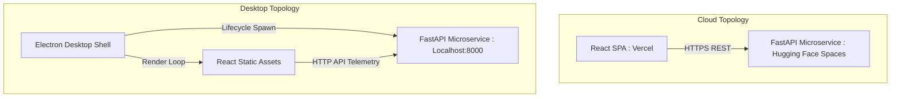

# Enterprise-Grade Sentiment Drift Detection System (GOEMO-V2)

An advanced, real-time customer experience analytics platform engineered to detect emotional trajectory shifts in support dialogues. Powered by a fine-tuned **DistilBERT Transformer model** trained on the 28-class GoEmotions dataset, the system performs vectorized drift calculations and predictive SLA risk analysis. Designed for high-performance operations, the project supports two deployment topologies: a scalable **Web Application** and a fully containerized **Electron Desktop Client** with an offline portable backend.

---

## 🏛️ System Architecture & Deployment Topologies

The platform supports hybrid delivery models depending on operational constraints:

### 1. Cloud-Native Web Topology
Operates on cost-efficient, highly scalable serverless and containerized tiers:
- **Frontend SPA**: Built in React 18, Vite, and TypeScript. Deployed to Vercel Free, utilizing static edge routing.
- **Microservice Backend**: Built on FastAPI and Uvicorn. Deployed inside a CPU-optimized Docker container on Hugging Face Spaces. Communicates via secure, CORS-restricted RESTful APIs.

### 2. Desktop Client Topology
Packages the complete stack into a standalone, portable Windows installer:
- **Application Shell**: Electron container running a native desktop window.
- **Process Orchestration**: Dynamically manages the lifecycle of a background python interpreter using relative virtual environment pathways (`env/Scripts/python.exe`), bypassing system-wide Python dependencies.
- **Process Safety**: Node-native process tree tree cleanup handles process signals to prevent orphaned Python or Uvicorn worker threads.



---

## 🔬 Core NLP & Analytical Processing Pipelines

The system computes real-time dialogue risk using three consecutive processing pipelines:

### 1. Transformer-Based Sentiment Extraction
- Employs a fine-tuned **DistilBERT architecture** that processes textual dialogue segments to output probability distributions over support-oriented categories.
- Translates machine predictions into **7 normalized, human-centric support tags**:
  - `STRESSED` (Anxiety, nervous indicators)
  - `OVERWHELMED` (Sadness, remorse, workload exhaustion)
  - `FRUSTRATED` (Disappointment, annoyance)
  - `SATISFIED` (Joy, gratitude, approval)
  - `RELIEVED` (Resolution acknowledgment)
  - `CONFUSED` (Puzzled states, curiosity loops)
  - `ANGRY` (High-intensity negative friction)
  - `NEUTRAL` (Nominal fallback state)

### 2. Syntactic Negation & Soft-Negative Resolution Heuristics
- Incorporates rule-based syntactic parsing to handle soft-negative expressions and modifiers that frequently trigger false "Neutral" classifications in basic models.
- **Heuristic Overrides Table**:
  | Modifiers / Phrase Patterns | Resolved NLP Class | Drift Coefficient | UI Glow Mapping |
  | :--- | :--- | :--- | :--- |
  | `"not happy"`, `"not too happy"`, `"not really happy"` | `disappointment` | `0.5` | Soft Red |
  | `"not great"`, `"not feeling well"`, `"not doing great"` | `sadness` | `0.5` | Soft Purple |
  | `"a bit frustrated"`, `"somewhat disappointed"` | `annoyance` | `0.8` | Neon Orange |
  | `"overwhelmed by workload"`, `"extreme stress"`, `"workload"` | `nervousness` | `0.6` | Purple-Blue |

### 3. Vectorized Drift & SLA Risk Modeling
- Calculates **Drift Velocity** in real-time by analyzing the emotional distance vectors between consecutive customer inputs.
- Triggers a proactive **SLA Breach Alert** when the emotional trajectory shows escalating frustration (`NEUTRAL` $\rightarrow$ `CONFUSED` $\rightarrow$ `ANGRY` / `FRUSTRATED`) or repeated friction markers.
- Automatically initiates recommended decisions via the **Decision Engine Panel** (e.g., automated response suppression, supervisor escalation, or tier-2 queue re-routing).

---

## 🎬 Cinematic Scenario Simulation Engine

For demonstration and enterprise-readiness verification, the monitor integrates a high-fidelity conversation simulation engine:
- **Interactive Scenarios**: Playback templates simulate actual transaction issues (e.g., **Subscription Cancellation Resistance**, **Mobile Checkout Friction**, **Empathetic Happy Path Rescue**).
- **Cinematic Delays**: Mimics human customer input delays (`1.5s - 2.5s`) and automated AI processing cycles (`1.8s - 2.8s`) with animated, responsive typing states.
- **Robust Lifecycle Safety**: Features comprehensive React `useRef` scheduling. Ensures all timers, timeouts, and callbacks are terminated instantly upon manual ticket switches, scenario cancellations, or component unmounting to completely eliminate memory leaks.
- **Manual Override Mode**: Allows the operator to inject custom simulated customer messages using direct keyboard input at any point during or after simulation loops.

---

## 🗂️ Directory Architecture

```text
├── app.py                      # Main production FastAPI application script
├── hf-backend/                 # Dedicated CPU-reduced backend code for Hugging Face
│   ├── app.py                  # Optimized space server script with dynamic Port binding
│   └── requirements.txt        # CPU-only PyTorch and Transformers requirements
├── emotion_model.py            # DistilBERT model loading, tokenization, and negation mapping
├── drift_detector.py           # Vectorized sentiment trajectory drift algorithms
├── escalation.py               # Rule-based SLA risk calculation and trigger engine
├── main.js                     # Electron main process controller with relative Python spawn routines
├── splash.html                 # Double-rotating neon orbit desktop splash screen
├── package.json                # Project root dependency manifest & build scripts
├── requirements.txt            # Main Python virtualenv package lists
└── frontend/                   # React Single-Page-Application directory
    ├── src/                    # Component files (LiveStream, Analytics, Alerts, Settings)
    ├── package.json            # React developer dependencies
    └── vercel.json             # Static path SPA routing mapping for Vercel Free
```

---

## ⚙️ Local Development Setup

### System Prerequisites
- **Python 3.10**
- **Node.js 18.x** or higher (with `npm`)

### 1. Environment Installation
1. **Clone & Navigate**:
   ```bash
   git clone https://github.com/Yash-Singh607/Emotion_Drift_Detection.git
   cd Emotion_Drift_Detection
   ```
2. **Setup Python Virtual Environment**:
   ```bash
   python -m venv env
   # Activate on Windows:
   .\env\Scripts\activate
   # Install Core ML & Web Packages:
   pip install -r requirements.txt
   ```
3. **Setup Node Package Managers**:
   ```bash
   npm install
   npm run install --prefix frontend
   ```

### 2. Running Dev Targets
- **Web Paradigm (Concurrent Dev)**:
  - Microservice (Terminal 1):
    ```bash
    .\env\Scripts\activate
    uvicorn app:app --reload --port 8000
    ```
  - Frontend SPA (Terminal 2):
    ```bash
    npm run dev:web
    ```
  - Console Portal: `http://localhost:5173`

- **Desktop Paradigm (Electron Dev)**:
  ```bash
  npm run dev:desktop
  ```

### 3. Production Compilation Scripts
- **Compile React Static Assets**:
  ```bash
  npm run build:web
  ```
- **Generate Standalone Desktop Installer**:
  ```bash
  npm run build:desktop
  ```

---

## ☁️ Production Deployment Topologies

For complete, detailed cloud deployment scripts, refer to [deployment_instructions.md](.system_generated/logs/deployment_instructions.md).

### 1. Frontend SPA Deployment (Vercel Free)
1. Initialize the deployment from the `frontend/` directory using Vercel CLI:
   ```bash
   cd frontend
   vercel
   ```
2. Add the environment variable `VITE_API_URL` pointing to your running Hugging Face Space endpoint (e.g., `https://username-space.hf.space`).

### 2. Containerized Model Microservice (Hugging Face Spaces)
1. Create a new Space on Hugging Face using the **Docker** platform option.
2. Push the files under `hf-backend/` along with your fine-tuned model weights directory (`emotion_model_trained_final/`).
3. Hugging Face will build the container with optimized CPU-only PyTorch libraries, running the service on port `7860`.
4. Configure `CORS_ALLOWED_ORIGINS` in your Space settings to whitelist your Vercel frontend domain.

---

## ⚖️ Technical Compliance & Specifications
- **CORS Protection**: Enforces strict origin matching utilizing `fastapi.middleware.cors`.
- **Large File Management**: Model checkpoint matrices (`model.safetensors`, 268MB) are tracked via Git LFS (`.gitattributes`) to prevent sync blocks.
- **Memory Optimization**: Uses optimized batch sizes and CPU PyTorch libraries to maintain RAM footprint below `1.5 GB` in standard container instances.

---

## Production Operations Checklist

### Pre-Deploy
- Set frontend env values in `frontend/.env.example` (`VITE_API_URL`, `VITE_APP_MODE=production`, `VITE_API_TIMEOUT_MS`).
- Set backend env values from `.env.production.example` (`APP_ENV=production`, `CORS_ALLOWED_ORIGINS`, `TRUSTED_HOSTS`, `PORT`, `LOG_LEVEL`).
- Use strong secrets (`AUTH_SECRET_KEY`, `SESSION_SECRET`) with at least 32 characters.
- Keep `AUTH_EXPOSE_TOKENS=false` in production.
- Run quality gates locally:
  - `npm run lint --prefix frontend`
  - `npm run test --prefix frontend`
  - `npm run build --prefix frontend`
  - `pytest -q`

### Health Checks
- Backend readiness: `GET /health` should return `{ "status": "ok" }`.
- API runtime headers should include `x-request-id` and `x-process-time-ms`.
- API security headers should include `x-content-type-options`, `x-frame-options`, and `referrer-policy`.
- Frontend operator badge in Live Stream should report `API_LINK: ONLINE`.

### Authentication
- Users can sign in with email/password or OAuth (`Google`, `GitHub`).
- New local accounts must verify email before accessing protected prediction routes.
- Password reset uses secure one-time tokens (`/auth/forgot-password` -> `/auth/reset-password`).
- API endpoints `/predict-emotion`, `/predict`, and `/timeline` require a verified bearer token.
- `/reset` and role-management endpoints are role-gated (`admin`/`agent` only for reset, `admin` only for user-role management).
- Auth routes:
  - `POST /auth/register`
  - `POST /auth/login`
  - `GET /auth/me`
  - `POST /auth/resend-verification`
  - `POST /auth/verify-email`
  - `POST /auth/forgot-password`
  - `POST /auth/reset-password`
  - `GET /auth/oauth/google/start`
  - `GET /auth/oauth/github/start`
  - `GET /auth/users` (admin)
  - `PATCH /auth/users/{user_id}/role` (admin)

### Rollback Guide
- Keep previous frontend deployment alias in Vercel and redeploy previous successful build.
- Revert backend container/image to last known working commit in Hugging Face Space.
- If incident scope is unknown, rotate to prior commit and disable new feature flags by keeping `VITE_APP_MODE=production`.

### Incident Debugging Basics
- Inspect backend request logs for request path, status code, request id, and response latency.
- Use `/timeline?session_id=<id>` to inspect ticket-scoped inference state.
- If frontend shows API offline, verify backend host reachability and CORS allowlist mismatch first.
